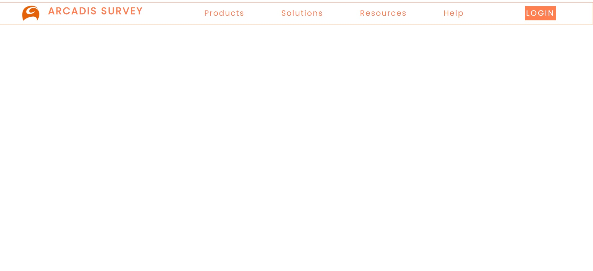
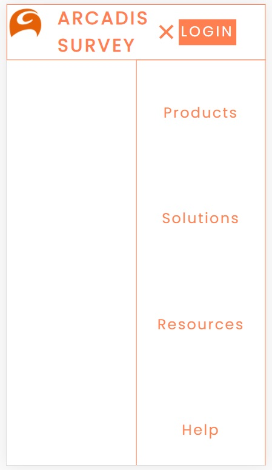
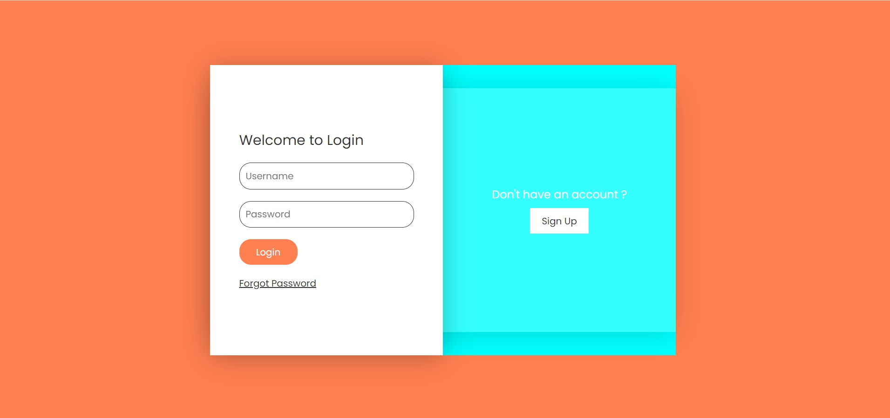
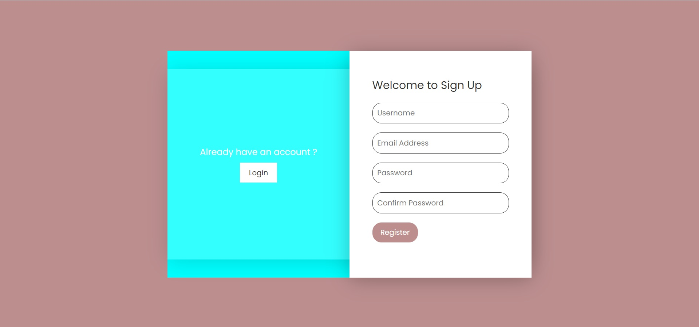
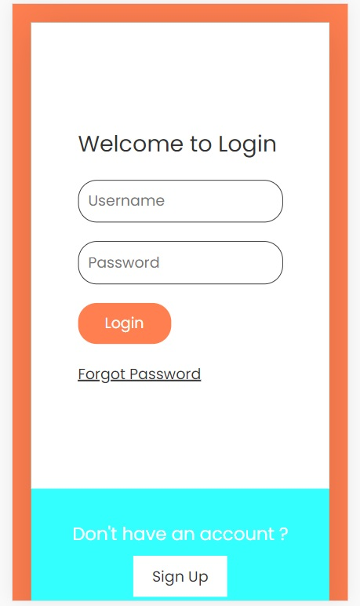
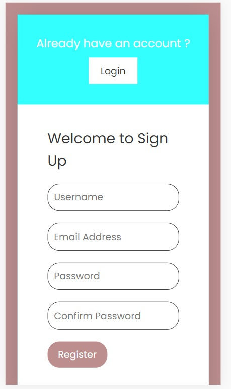

# Survey Application

This project is made for taking Survey for a product or procedure.

## Technology Stack

- HTML
- CSS
- JavaScript

## API Reference

### Home Page

#### Get items

| Parameter | Type     | Description                       |
| :-------- | :------- | :-------------------------------- |
| `burger`      | `querySelector` | **Required** for accessing burger class |
| `nav`      | `querySelector` | **Required** for accessing nav tag |
| `navLinks`      | `querySelector for multiple items` | **Required** for accessing all the li tag inisde navLinks |

#### burger.addEventListner(args)

Defines clickable property for burer icon.\
Activate or deactivate the navigation bar on clicking the burger icon to show or hide the navigation bar.

It adds **nav-active** class to nav tag for performing some styling.

It takes all the links inside nav tag to define an amination of those link items.

It changes the class for **burger** to **toggle**

### Login and Sign Up page

#### Get items

| Parameter | Type     | Description                       |
| :-------- | :------- | :-------------------------------- |
| `loginButton`      | `querySelector` | **Required** for accessing contents of loginBtn class |
| `signUpButton`      | `querySelector` | **Required** for accessing contents of signUpBtn class |
| `formBackground`      | `querySelector` | **Required** for accessing contents of formBg class |

#### signUpButton.onclick()

It adds an extra class **active** in div tag apart from **formBg** class when the signup button is clicked./
It also adds **active** class to body tag.

#### loginButton.onclick()

It removes **active** class which was along with **formBg** as well as from body tag.

## Screenshots

## Postulation

It is an underdevelopment project

## Motto

To make a full fledged survey application

## Appendix

### Navigation

Navigation tag contains a logo, some navigation links and a burger button.

### Login and Sign Up

This page contains a big container having two section- (1) Blue Background and (2) Form Background

Blue Background contains either a decision to switch to login or to to sign up.

Form Background containes Form according to the need

### How to run

Download and run in any browser with latest update.